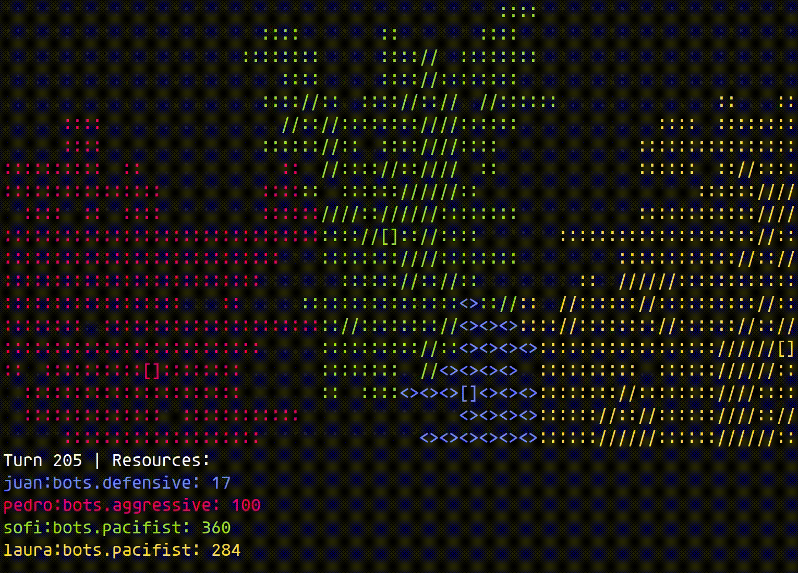

# Terminal of Empires

A simple terminal turn-based strategy game where you build an empire and fight against others, all by programming your own bots in Python.

Made for a PyCamp, but can be played by anyone.



# Installation

A relatively modern Python 3 is required, and using virtualenvs is highly recommended.

```bash
python3 -m venv toe_venv  # create a virtualenv
source toe_venv/bin/activate  # activate the virtualenv
pip install -r requirements.txt  # install dependencies
```

# Playing

To play, just run `toe.py` specifying the names and bot types of the players:

```bash
python toe.py --players juan:defensive,pedro:aggressive,sofi:pacifist,laura:pacifist
```

The first player to conquer the rest of the players wins.
To conquer another player you must destroy all of their castles (each player starts with one castle).

By default, the game includes these bot types for you to practice and learn from:

- `passive`: a bot that just sits there without doing anything.
- `pacifist`: a bot that expands only by conquering neutral terrain and building farms, never attacks other players.
- `aggressive`: a bot that attacks whenever possible, but never builds defensive or production structures.
- `defensive`: a bot that builds lots of forts and attacks a bit.
- `super_random`: a bot that tries to do random (usually invalid) moves.

There are more options that allow you to control the size of the map, speed of the game, etc.
Consult them with:

```bash
python toe.py --help
```

For instance, `--ui-turn-delay` is a very useful one if you want to play faster matches :)

Also, each match produces a very detailed `toe.log` with all the actions the bots tried to play and their results. 
You can even query the log live, while the game is playing.

# Making your own bot

To make your own bot logic, just create a Python file in the `bots/` directory that defines a class called "BotLogic", which should have the following methods:


`bots/my_super_bot.py`
```
from game import Position, Terrain

class BotLogic:
    def turn(self, map_size, my_resources, world):
        """In this method you program the logic of your own bot."""
```

The `turn()` method will be called by the game on each turn, to ask your bot "what do you want to do now?".
The parameters that you will receive are these:

- `map_size`: a `(width, height)` tuple with the size of the map.
- `my_resources`: an integer with the amount of resources you have available to spend.
  It can be spent to build structures, or to attack other players and conquer terrain.
- `world`: a 2D grid with the current state of the world.
  Each cell contains a `Terrain(owner, structure)` value, and is referenced by a `Position(x, y)` key.
  More on this in the "Game World" section.

As a result, your `turn()` method must return an action, or None if your bot doesn't want to do anything on this turn.
An action is a tuple with two elements: `(action_type, position)`.
This indicates which type of action you want to perform, and where.
More info on this in the "Actions" section.

# Game World

The game world is a dictionary.
The keys are `Position(x, y)` objects, which have `x` and `y` attributes representing the coordinates in the map.
And the values are `Terrain(owner, structure)` objects, containing two attributes:

- `owner`: the name of the player owning that piece of land.
  If it's yours, it will say `"mine"`.
  If it's neutral (not owned by any player), it will be `None`.
- `structure`: what type of structure there is in that piece of land, it can be: `"land"`, `"farm"`, `"fort"`, `"castle"`.

You can inspect the entire world to see what's there.
For instance, to see who's the owner of the position x=10, y=20, you could do:

```python
who_owns_it = world[Position(10, 20)].owner
```

To see if that position has a castle, you could do:

```python
if world[Position(10, 20)].structure == "castle":
    print("yes, it is!")
```


### Land

Land is just that, empty land.
It doesn't produce resources, doesn't defend, doesn't do anything.
And it can be easily conquered.
But you need to own land to be able to build structures in it.

### Farm

Farms produce resources during harvest.
But they're easy to conquer.

### Fort

Forts are very hard to conquer.
They can also protect nearby land and farms.

### Castle

Castles are the most important structure.
They protect nearby land and farms, like a fort.
But they also produce resources, like a farm.
They're like a Farm+Fort.
A Fart, if you will.
If a player loses all their castles, they're eliminated from the game.

# Actions

Actions are always a tuple of two elements: `(action_type, position)`.
The `action_type` is a string indicating what you want to do, and the `position` is a `Position(x, y)` object indicating where you want to do it.

These are the possible actions:

### "harvest"

Produce resources in every farm and castle that you own, at once.
Each one of them will produce 5 resources for you.

For instance, if you have 4 farms and 2 castles, you will get 30 resources in total.

This is the only action in which the `position` parameter is ignored.
Just use a `None` value, like this:

```python
return "harvest", None
```

### "farm", "fort", "castle"

If the `action_type` is the name of a structure, you're trying to build that structure in the position indicated by the `position` parameter.

Structures can only be placed on terrain you already own.
You will need to conquer terrain to then be able to build on top of it once you own it.

You can also build "on top" of existing structures, replacing them.
For instance, if you build a farm on top of a fort, the fort will be destroyed and the farm will be built in its place.

Structures cost resources:

- Farms cost 5 resources.
- Forts cost 25 resources.
- Castles cost 75 resources.

For instance, if you want to build a farm in the position x=10, y=20, you could do:

```python
return "farm", Position(10, 20)
```

Just remember that you need to have enough resources to build the structure, and that you must build on your own terrain.

### "conquer"

If the `action_type` is "conquer", you're trying to conquer the terrain in the position indicated by the `position` parameter.
To be able to conquer a piece of terrain, you must:

- be attacking a piece of terrain that is adjacent to a piece of your own terrain, you can't attack from a distance.
- have enough resources to conquer the terrain.

Different structures can be conquered with different costs, depending on how well defended they are.
The costs are:

- Land: 1 resource.
- Farm: 2 resources.
- Land or Farm that has a Fort or a Castle adjacent to it (not diagonally): 25 resources. 
  **This is how Forts and Castles protect nearby land!**
- Fort: 50 resources.
- Castle: 100 resources.

For instance, to conquer position x=10, y=20, you could do:

```python
return "conquer", Position(10, 20)
```

If you order a valid conquer action, the result is that the enemy structure will be destroyed and you will own that piece of terrain (which will now be just "land").

# Bot examples

You can find more examples in the `bots/` directory. 
Take a look at them, their code is fairly simple and easy to understand, they're meant as examples for you to learn from :)

Have fun!
